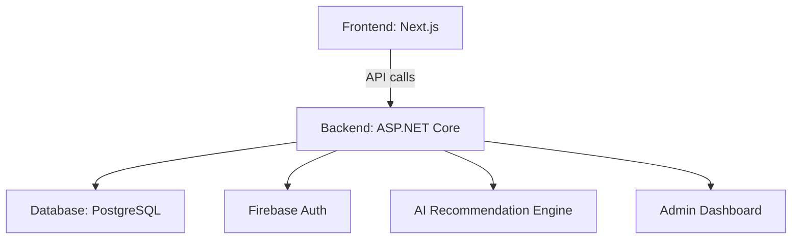

# EcoRent - Electric Car Rental System

A smart C2C Electric Vehicle Rental Platform featuring AI-powered car recommendations, automated driver dispatching, and real-time operational analytics.

---

## 🚀 Tech Stack

- **Backend**: ASP.NET Core 8 (Clean Architecture)
- **Frontend**: Next.js (TypeScript)
- **Database**: PostgreSQL (Entity Framework Core)
- **Authentication**: JWT + Firebase Phone Auth

---

## ✨ Features

- Electric car rental marketplace (C2C)
- AI-powered car recommendations
- Automated driver dispatching
- Real-time analytics dashboard
- KYC & Identity verification (OCR, phone, OTP)
- Owner subscription packages
- Admin management
- Multi-role user system (Customer, Owner, Admin)
- Secure authentication (JWT, Firebase Phone)
- Responsive UI (Next.js, Tailwind CSS)

---

## 🏗️ Architecture



### Backend Layers

- `CAR.Domain/`: Entities, Enums, Constants
- `CAR.Application/`: DTOs, Interfaces, Business Logic
- `CAR.Infrastructure/`: Repositories, Services, DbContext
- `RentalCar/`: API Controllers, Middleware

### Frontend Structure

- `src/app/`: Next.js App Router pages
- `src/components/`: React components
- `src/hooks/`: Custom hooks
- `src/services/`: API service functions
- `src/types/`: TypeScript types
- `src/lib/`: Utility functions

---

## ⚙️ Prerequisites

- .NET 8 SDK
- Node.js >= 18
- PostgreSQL >= 14

---

## 🛠️ Installation

1. Clone repo:

   ```bash
   git clone <repo-url>
   ```

2. Cài đặt backend:

   ```bash
   cd backend && dotnet restore
   ```

3. Cài đặt frontend:

   ```bash
   cd frontend && npm install
   ```

---

## 🔧 Configuration

- Backend: Sửa `appsettings.json` (connection string, JWT, Firebase...)
- Frontend: Sửa `.env` (API base URL, Firebase config...)
- Database: Tạo database PostgreSQL, update connection string

---

## ▶️ Running the App

- Backend:

  ```bash
  cd backend/RentalCar && dotnet run
  ```

- Frontend:

  ```bash
  cd frontend && npm run dev
  ```

---

## 📖 API Documentation

- Swagger: `http://localhost:8080/swagger` (sau khi chạy backend)
- API Response Format:

  ```json
  {
    "success": true/false,
    "message": "Mô tả kết quả",
    "data": { /* response data */ }
  }
  ```

---

## 📁 Project Structure

...existing code...

---

## 🤖 AI Coding Rules

Xem [.github/copilot-instructions.md](.github/copilot-instructions.md) cho coding conventions khi sử dụng AI assistants.

---

## 🤝 Contributing

1. Đọc file [.github/copilot-instructions.md](.github/copilot-instructions.md) trước khi gọi AI để code
2. Tạo branch mới cho mỗi feature/bugfix
3. Commit message bằng tiếng Anh, rõ ràng
4. Viết unit test cho business logic
5. Pull request phải được review trước khi merge
